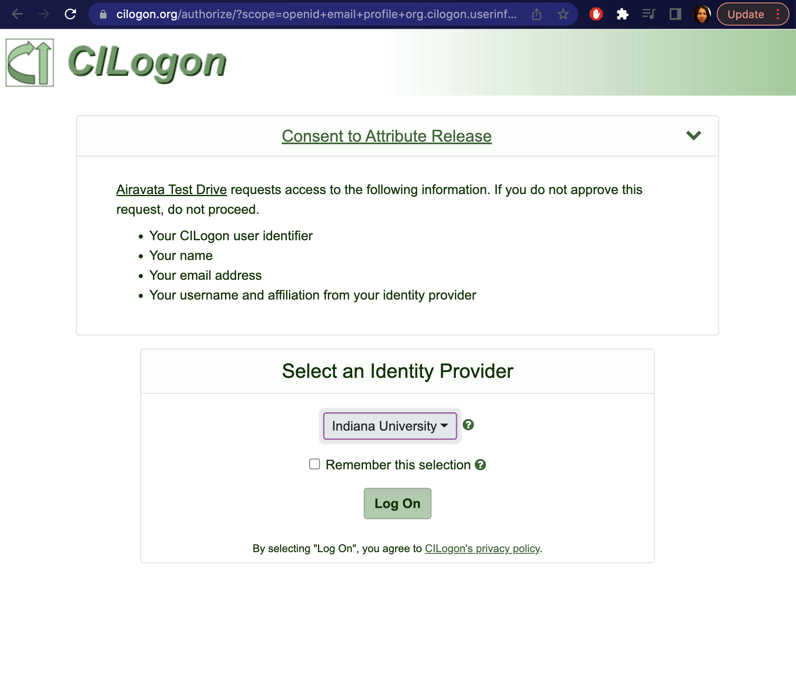

## Portal Account Creation
- Two ways to create your account and get access
    - <a href= "#Exist Login">Use Existing Institutional Login</a>  
    - <a href= "#Local">Create Local Account</a> 

Image: Create Account Page
##### <h5 id="Exist Login">Use Existing Institutional Login</h5> 
1. This is the mostly used option.
2. Click "Sign in with existing institutional credentials" button.
3. In the next window choose your institute or google as the option.
4. After institutional redirection, now you have access to the portal "Workspace".  
    TIP: Still you may not have permission to actually launch jobs, but your gateway admin will take care of it. 

Image: Institutional Selection Page 

##### <h5 id="Local">Create Local Account</h5>
1. In your portal navigate to Account Creation (e.g.: https://testdrive.airavata.org/auth/create-account)
2. For local account creation provides the details under "Create an Airavata Test Drive Gateway account"
3. Once you submit, you would receive an email verification  
    TIP: This mail could land in your spam, so keep an eye!
4. Verify your email and you will be in your portal "Workspace"!  
    TIP: Still you may not have permission to actually launch jobs, but your gateway admin will take care of it. 

