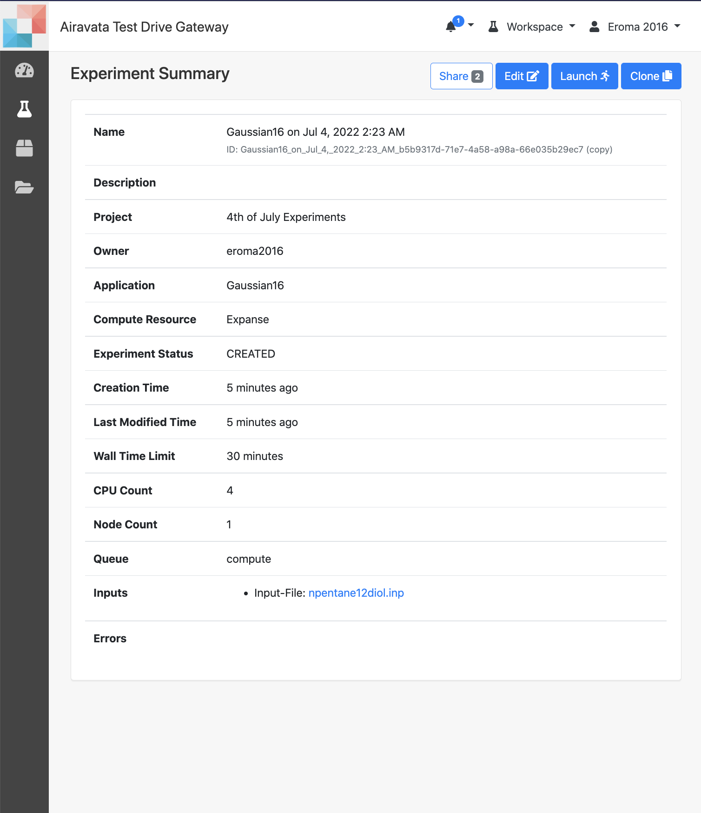
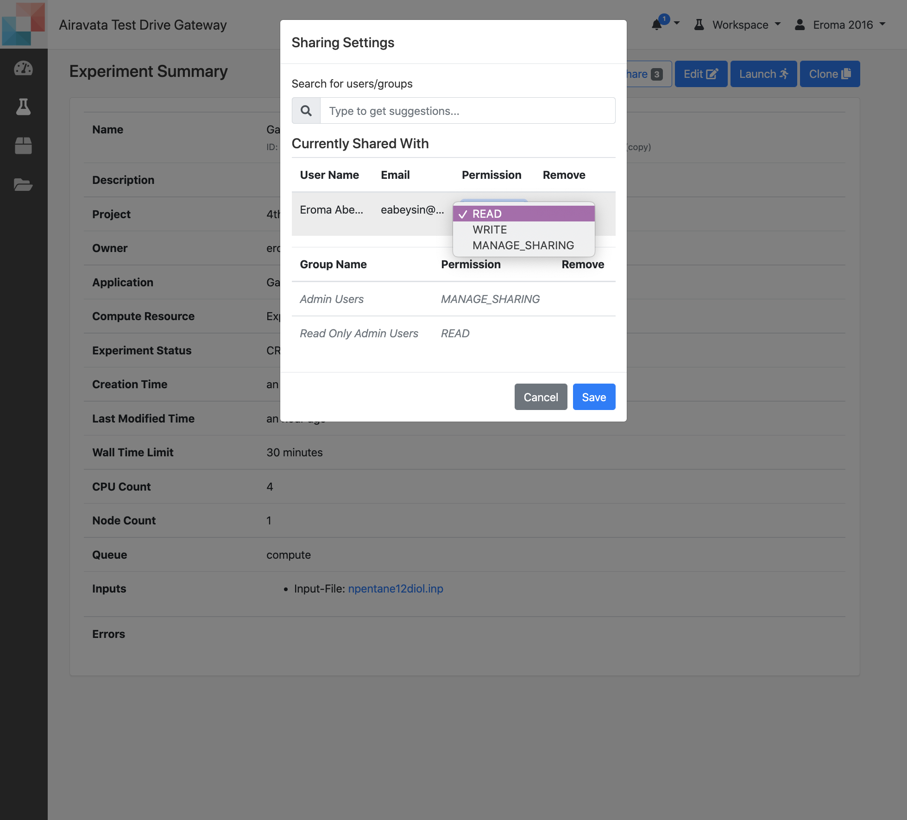

## Clone, Cancel & Share your Experiment
- Available actions on Experiments
    - <a href= "#clone">Clone</a>  
    - <a href= "#share">Share</a> 
    - <a href= "#cancel">Cancel</a> 
    - <a href= "#edit">Edit</a> 
    - <a href= "#launch">Launch</a> 

Image: Actions available on Experiment
##### <h5 id="clone">Clone Experiment</h5>
1. Cloning an experiment is available from "Experiment Browse" and "Experiment Summary" pages.
2. Cloning is creating a new experiment to launch a new job from a previous experiment.
3. Once cloned, user can change the input files or computational resource queue properties and launch the newly cloned experimnet.
4. A general user can clone its own experiment as well as ones shared by others.
5. Irrespective of the existing status of the experiment, user can clone and create a new one.

##### <h5 id="share">Share Experiment</h5>
1. Sharing is available through "Experiment Summary" page.
2. You can share with an individual or a user group.
3. When sharing you can specify the permission as READ, WRITE or MANAGE_SHARING.
4. After you have share, you can change permissions or un-share.
  

Image: Share an Experiment
5. When you share with READ permission, the shared with person/group can view your experiment files, clone your experiment.
6. When you share with WRITE permission, the shared with person/group can view files, clone yours, launch or cancel your experiment.
7. With MANAGE_SHARING the shared with person/group can do all above (READ & WRITE capabilities) and share your experiment with other gateway users.

##### <h5 id="cancel">Cancel Experiment</h5>
1. Canceling an experiment is available from "Experiment Summary" page.
2. You can ONLY cancel an experiment in "LAUNCHED" or "EXECUTING" state.
3. Canceling an experiment will cancel job running on the remote computational resource.

##### <h5 id="edit">Edit Experiment</h5>
1. Can edit experiments in "CREATED" state.
2. Editing is available from "Experiment Summary" page.

##### <h5 id="launch">Launch Experiment</h5>
1. Launching an experiment is only for experiments in "CREATED" state and available from "Experiment Summary" page.

