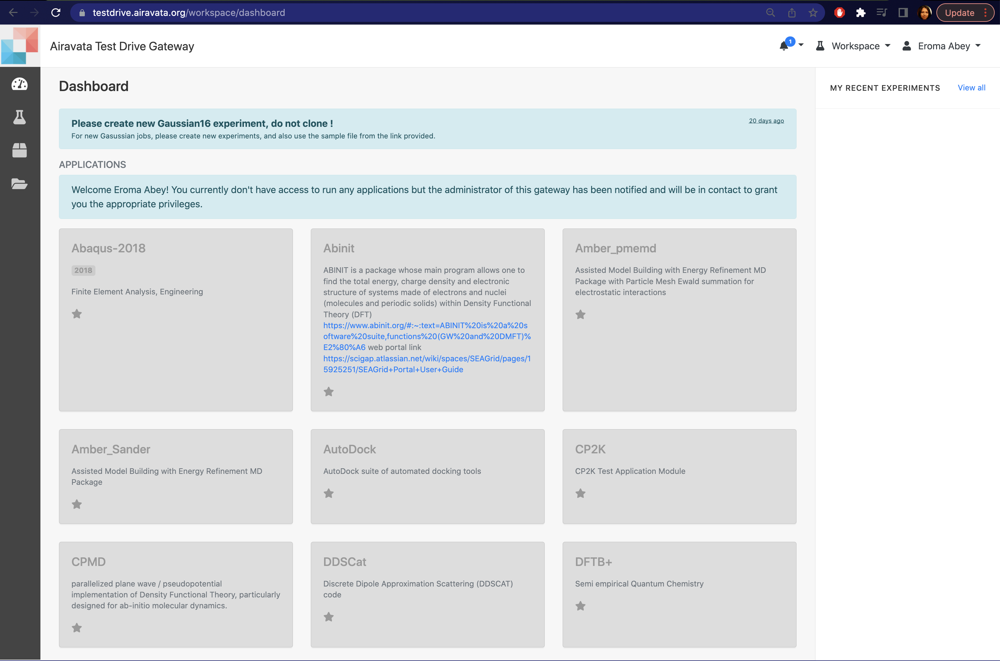

## Create Experiments & Launch Jobs
- To create "Experiments" and launch "Jobs" you need to know your
    - <a href= "#workspace">Workspace</a>  
    - <a href= "#createexp">How to Create Experiments</a> 
    - <a href= "#launchjob">How to Launch Jobs</a> 

##### <h5 id="workspace">Workspace</h5>         
1. "Workspace" is your central interface after login.
2. Based on your permission level you would have access to information.
3. Generally as soon as you create your login and access this page, you would see grayed out "Applications" (See Image: Portal Workspace)
4. Applications are your tools or codes that you would select to launch jobs ar remote resources. 
    TIP: Mark your "Favorites" using the star on the tile.
5. On your right, you would see your latest computational experiments and their statuses.

Image: Portal Workspace

##### <h5 id="Local">Create Experiment</h5>
1. The 'Experiment' is what you create using an existing Application in the workspace to launch a job in an external computational resource.
2. Select an application from the workspace and you would then be able to create an experiment providing the inputs and computational resource queue properties.
3. After providing the required inputs and creating the experiment either "Save & Launch" or "Save" to launch later.
4. An experiment may have one-to-one or one-to-many relationship with computation jobs launched at remote resources. 

Image: Create Experiment Page

##### <h5 id="Local">Launch Jobs</h5>
1. Launching a job from the gateway results in creating a job script, generating a Job Name, creating a working directory for the job in remote computational resource and submitting a job.
2. Saving and launching a created experiments will submit a job.
3. Once the job is submitted the remote resource will response back with a job ID.
