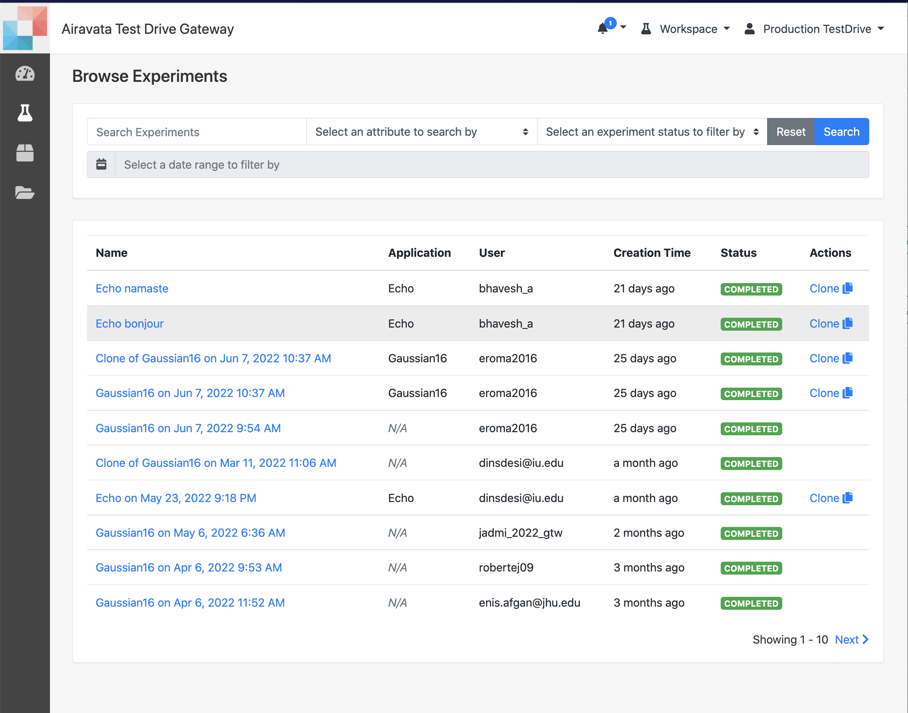
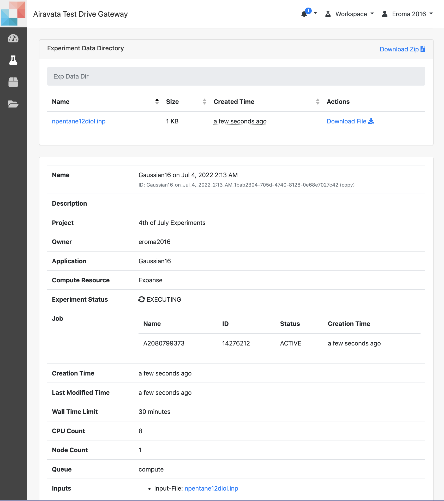
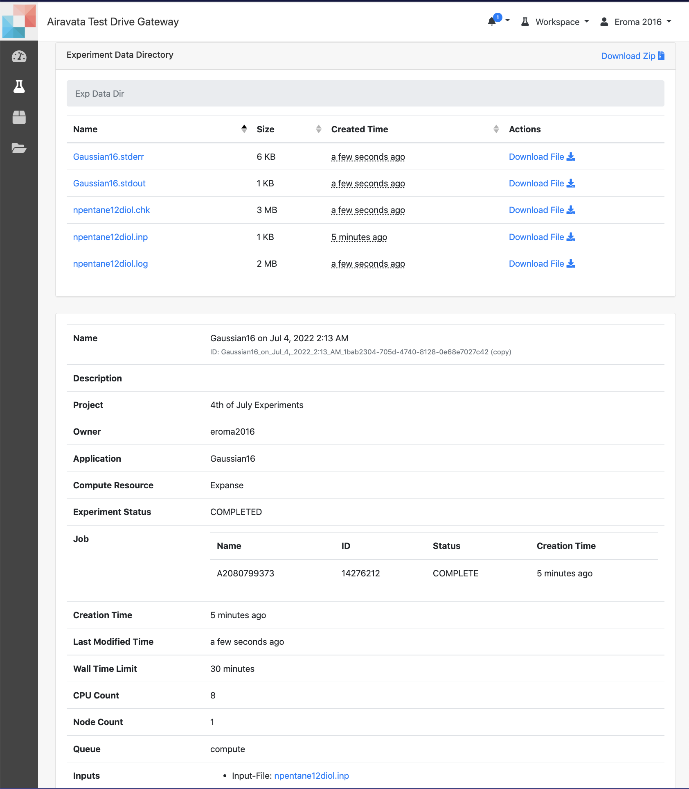

## Monitor Experiments
- In the gateway after launching an experiment, you can 
    - <a href= "#monexp">Monitor Experiment Status</a>  
    - <a href= "#monjob">Monitor Job Status</a> 
    - <a href= "#fetchfile">Fetch Intermediate Files</a> 

##### <h5 id="monexp">Monitor Experiments</h5>         
1. Individual experiment status can be monitored from 'Experiment Summary Page'. 
2. User can also view all the experimetns statuses from 'Experiment Browse' page as well and further monitory a selected specific one. 
2. Based on your permission level you would have access to information.
3. Generally as soon as you create your login and access this page, you would see grayed out "Applications" (See Image: Portal Workspace)
4. Applications are your tools or codes that you would select to launch jobs ar remote resources. 
    TIP: Mark your "Favorites" using the star on the tile.
5. On your right, you would see your latest computational experiments and their statuses.

Image: Browse Experiments 

##### <h5 id="monjob">Monitor Jobs</h5>
1. The 'Experiment' is what you create using an existing Application in the workspace to launch a job in an external computational resource.
2. Select an application from the workspace and you would then be able to create an experiment providing the inputs and computational resource queue properties.
3. After providing the required inputs and creating the experiment either "Save & Launch" or "Save" to launch later.
4. An experiment may have one-to-one or one-to-many relationship with computation jobs launched at remote resources. 

Image: Experiment Summary with Active Job
   
    
Image: Experiment Summary with Completed Job & Outputs

##### <h5 id="monjob">Monitor Jobs</h5>