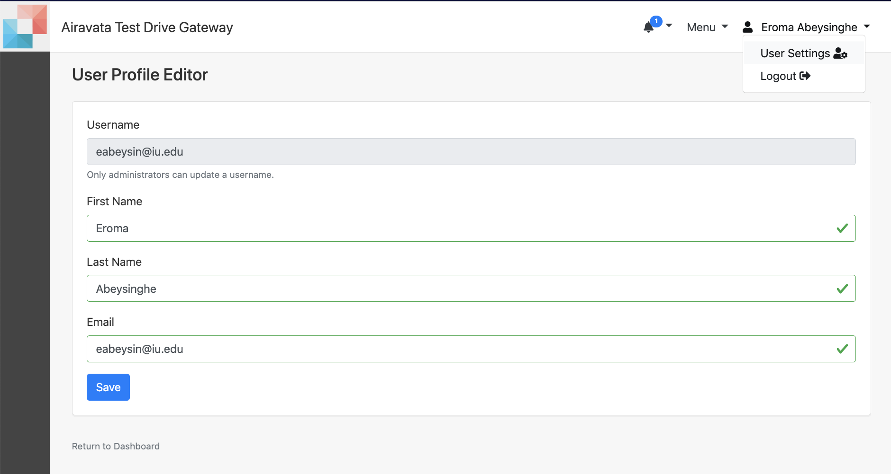

##Django Gateway Theme Management

What else is available for you in the gateway portal?
  
- <a href= "#createproj">Create Projects</a>  
- <a href= "#storage">Manage Storage</a> 
- <a href= "#usersettings">Update User Settings</a> 
- <a href= "#sshgen">Generate Own SSH Keys</a> 
- <a href= "#viewnotices">Keep an Eye on Notices</a> 

##### <h5 id="createproj">Create Projects</h5>
1. The gateway has the 'Default Project' created for you. You can us this project as a holder for your experiments.
2. Apart from the system created one, you can also create your own projects to hold your experiments; a mechanism of grouping your experiments.
3. Projects can also be share with other gateway users and gateway user groups.
4. When you share, you can set permissions to either READ, WRITE or MANAGE_SHARING.

##### <h5 id="storage">Manage Storage</h5>
1. Using the "Storage" page, users can manage their existing data files, upload new files, create new directory structures and also get rid of existing files and directories.
2. Users also have the option of downloading files and directories from this page.
3. The storage will show the sizes of each directory and each file to the user.
4. When creating experiments users have the option of uploading files existing in the storage.

Image: Manage Storage

##### <h5 id="usersettings">Update User Settings</h5>
1. The "User Settings" will enable you to change your details and email within the gateway.
2. When changing email, its only accepted after the email verification step. You would be displayed "Once you verify your email address at testing.email@gmail.com, your email address will be updated. If you didn't receive the verification email, click here to resend verification link."

Image: User Profile Editor

##### <h5 id="sshgen">Generate Own SSH Keys</h5>
1. This is for you to generate your own SSH SSH credentials to use to connect to your own allocations through the gateway.
2. As a generic gateway user keys you generate are invincible to everyone else.
3. But always you hav the option of sharing it with any other user or user group with permissions; READ, WRITE or MANAGE_SHARING

Image: Generate New SSH Credentials

##### <h5 id="viewnotices">Keep an Eye on Notices</h5>
1. Pretty much what the title says, on the top menu you would see the 'Bell' and you can view notices by the gateway admin.
2. You also have the option of "Mark as Read"
3. The messages has an expiration set by the gateway admin and upon expiring it will get removed from the list.
