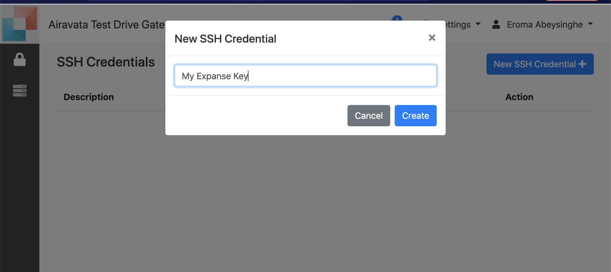
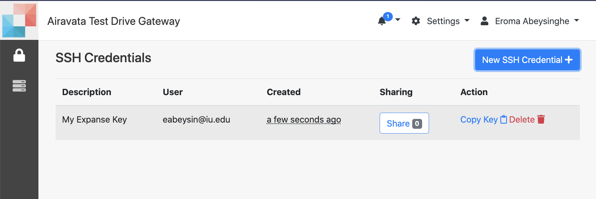
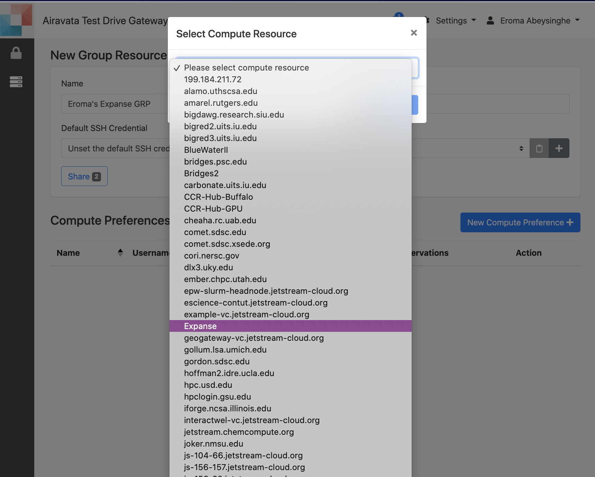
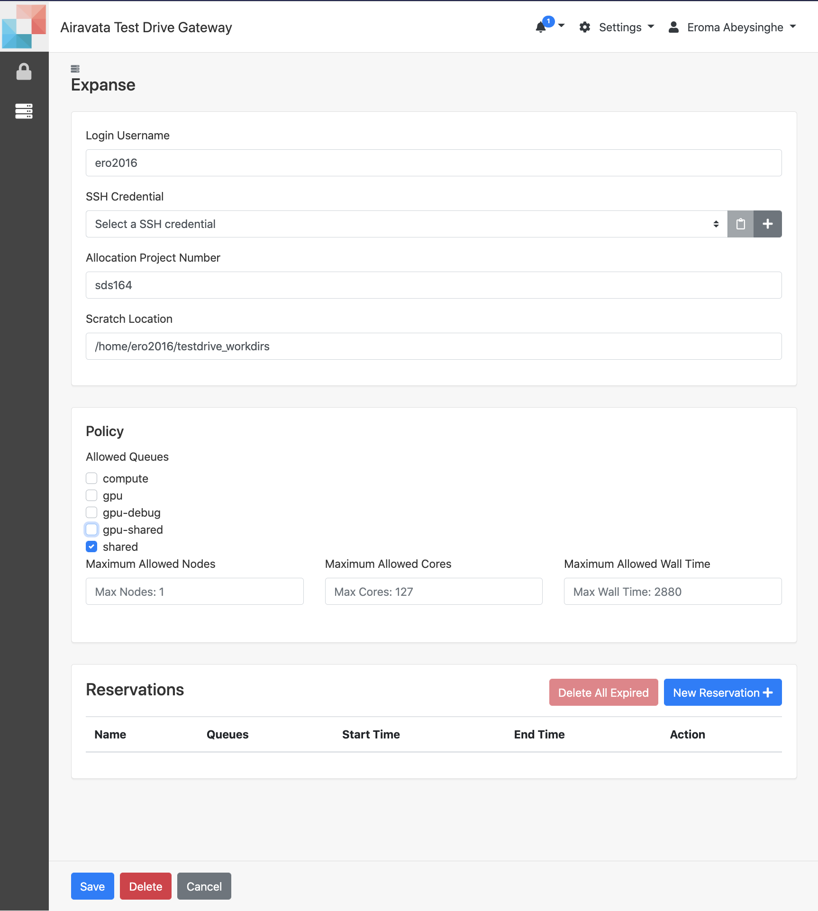

##Use Your Allocation for Jobs

- The gateway generally has allocations added by the gateway admin. This allocation is for all the gateway users to use through a single login in the remote computational resource.
- This single login is known as either "Group login" or a "Community Login".
- Apart fom using the above allocation and login, you can use your own allocation and login for your own jobs.
- This could be on your campus resource or on a national resource such as an XSEDE resource.

#####<h5 id="generate sshe">Generate Personal SSH Key</h5>
1. The gateway uses SSH keys to connect with remote computational resources. 
2. Generate your own to use with your allocation. 
3. Note that the generated key has 0 shares as its your own key. 
4. Login to the compute resource you have the allocation from, e.g. If its XSEDE Expanse, you could SSH to it and access using your password. SSH testuser@expanse. xsede.ucsd.edu
5. Add the newly generated key to your /.ssh/authorized_keys file. If you don't have such file you can create it and add.
6. Please note in case the resource has enabled two factor authentication for individual user login, please contact your gateway admin to discuss ways your allocation can be used within the gateway.

Image: Generate SSH Key

##### <h5 id="creategrp">Create Your Own Group Resource Profile (GRP)</h5>
1. Provide the details such as GRP name, the SSH key and then select the remote resource.
2. Add the remote computational resource details such as login name, scratch location, allocation project number and the queue details of the resource.
3. In the GRP, users can add reservation details for compute resources as well.
4. In a single GRP, you can have multiple resources added, queues and their properties selected for gateway users.
  

Image: Create GRP

##### <h5 id="creategrp">Use Your Allocation for Job Submissions</h5>
1. Now that you have successfully generated and added your SSH and created your GRP, you are ready to use your allocation for computational jobs.
2. When creating a new experiment, under allocation you should be able to view your created GRP, select that and the job will be using your allocation. 

<ADD>---------

Image: Use Your Allocation for Jobs
