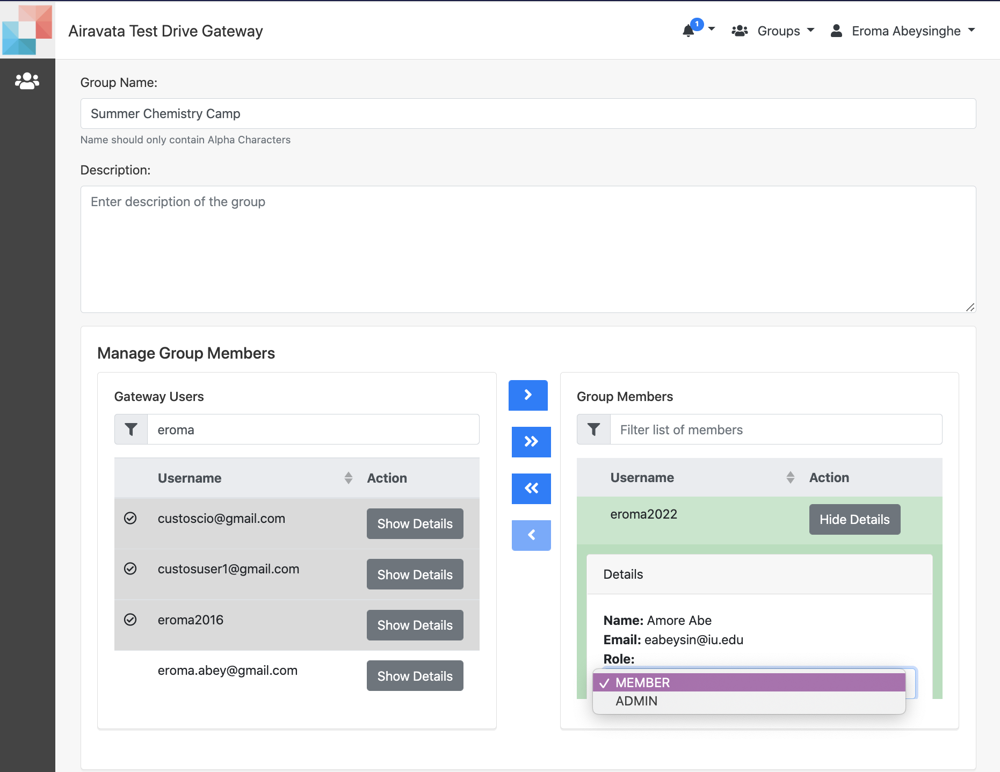

##Use Your Allocation for Jobs

- The gateway generally has allocations added by the gateway admin. This allocation is for all the gateway users to use through a single login in the remote computational resource.
- This single login is known as either "Group login" or a "Community Login".
- Apart fom using the above allocation and login, you can use your own allocation and login for your own jobs.
- This could be on your campus resource or on a national resource such as an XSEDE resource.

##### <h5 id="viewgroups">View User Groups</h5>
1. In Groups page, you can view all the groups available in the gateway.
2. If you are an admin of a particular group, you would be able to edit and add new users to the group.
  

Image: View User Groups

##### <h5 id="creategroup">Create User Groups</h5>   
1. Create your own groups from "Groups" interface.
2. You can add other gateway users to your group and give them either 'Member' role or 'Admin' role.
3. Members are just in your group and when you share your experiments or computational allocation with the group they can access them.
4. Admin role will enable those users to add other users to your group.
5. Only the group "Owner" can change the roles of other users.
  

Image: Create User Group