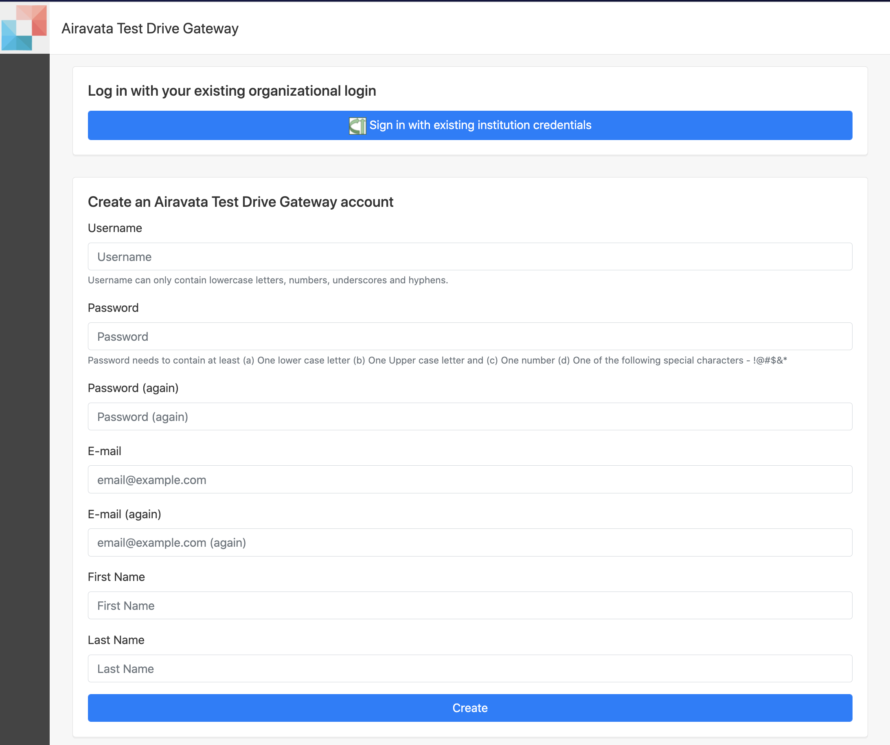
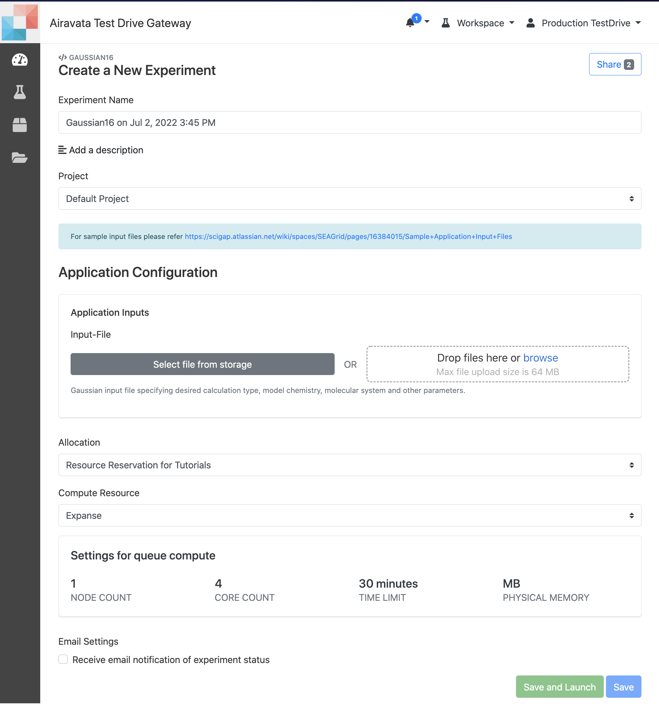

## Quick Start Steps
1. Create your account in the gateway portal either using your existing institutional login through CILogon OR by creating a local account.
 For more information refer: <a href="/user-documentation/account-creation" target="_blank">Account Creation</a> 
 

Image: Create Account Page

2. Login to the gateway portal, in 'Workspace' make sure the applications/tools you plan to use are enabled; not grayed out.
  

3. Create experiments under the applications/tools you plan to use and submit jobs in remote computational resources.
  For more information refer: <a href="/user-documentation/create-experiment-launch-job" target="_blank">Create Experiment & Launch Jobs</a> 
  

Image: Create Experiment Page

4. After submitting your job, you can monitor it until completion. You can add your email to receive emails upon job completion on remote resource. 
  For more information refer: <a href="/user-documentation/monitor-experiment" target="_blank">Monitor Experiments & Jobs</a> 
  

5. While the job is active, you have several options available; Cancel, Share, Clone
  For more information refer: <a href="/user-documentation/clone-cancel-share" target="_blank">Clone, Cancel or Share your Experiment and Job</a> 
  

6. Users can also fetch intermediate files while the job is active in remote resource. This is useful especially for long running jobs, as you can monitor th results and take necessary steps as needed. 

