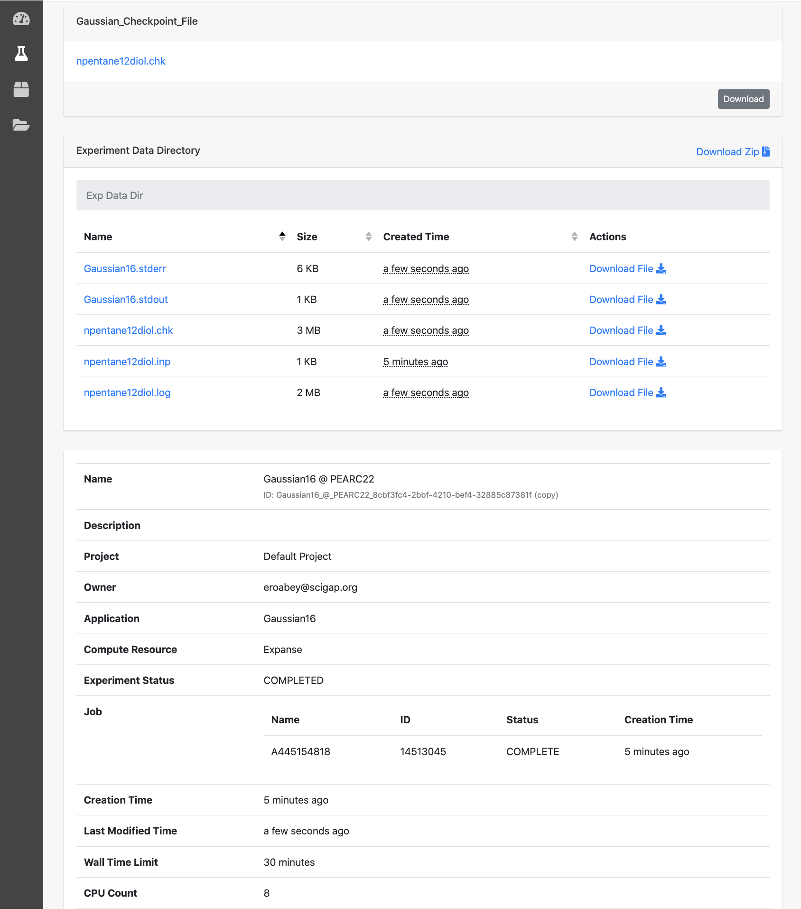

## Tutorial Hands on: run a Gaussian16 computational experiment in the Django portal

1. Log into <a href="https://testdrive.airavata.org/" target="_blank"><b>TestDrive Portal</a></b>
  
2. First, you'll need a user account. <a href="https://testdrive.airavata.org/auth/login" target="_blank"><b>Create an account</a></b> using your existing institutional login through CILogon. 
  
3. After you've logged in, an administrator can grant you access to run the _**Gaussian16**_ application. 
  
4. During the tutorial we'll grant you access right away and let you know. 
  
5. When you log in for the first time you will see a list of applications that are available in this science gateway. Applications that you are not able to run are greyed out but the other ones you can run. 
  
6. Once you are granted access, refresh the page and you should now see that you the _**Gaussian16**_ application is not greyed out.
  

#####Submit a Test Job
1. From the dashboard, click on the _**Gaussian16**_ application. The page title is _Create a New Experiment_.
  
2. Here you can change the _Experiment Name_, add a _Description_ or select a different Project if you have multiple projects. For now use the _Default Project_.
  
3. We'll focus on the Application Inputs for this hands-on. The _**Gaussian16 application**_ requires one input, an Input-File. 
  
4. The following is a preconfigured _**Gaussian16**_ input file. Download this to your local computer and then click the _Browse_ link to upload the file:
  
     <b>  [npentane12diol.inp](../img/npentane12diol.inp)</b>
  
5. You can click on the file to take a quick look at the file in a popup window.
  
6. Now we'll select what _Allocation_ to charge and where to run this job. Use _Resource Reservation for Tutorials_ allocation for the job. Under Compute Resource make sure you select _Expanse_.
  
7. Then click Save and Launch.
  
8. You should then be taken to the _**Experiment Summary**_ page which will update as the job progresses. 
  
9. When the job finishes you'll be able to download the _.log_ file which is the primary output file of the gaussian application.
  
10. We'll come back to this experiment later in the tutorial.

Image: Gaussian16 Experiment Creation

#####View & Download Results 
1. After job submission to _Expanse_, you will able to see job status, going from SUBMITTED &rarr; ACTIVE &rarr; COMPLETE
2. Then the experiment status would change to COMPLETED, when all the files are available for you to view and download.
NOTE: When you see the experiment status COMPLETED, refresh the page.

Image: Completed Gaussian16 Job Outputs

#####More Details On...
1. <a href="/user-documentation/account-creation" target="_blank">Portal Account Creation</a>
2.  <a href="/user-documentation/create-experiment-launch-job" target="_blank">Submit Job</a>